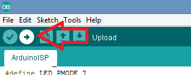
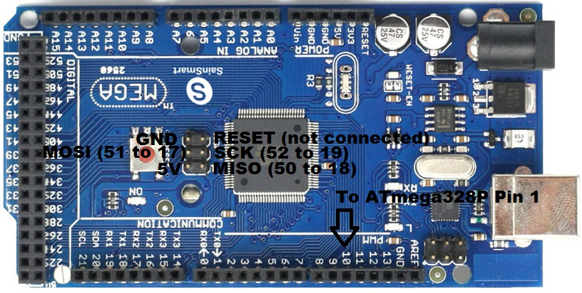
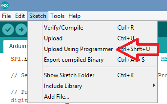

# Flashing the ATmega328P with an Arduino Mega2560

How to use an Arduino Mega2560 as a programmer.  
Assuming processor on target Arduino is the ATmega328P

## Arduino IDE setup for flashing ArduinoISP.ino sketch

1. Preparing sketch   

First step to transform the Mega2560 into a programmer is to flash the Arduino.ino sketch. Load the ArduinoISP sketch from the examples:


noting code change:

```
// Uncomment following line to use the old Uno style wiring
// (using pin 11, 12 and 13 instead of the SPI header) on Leonardo, Due...

#define USE_OLD_STYLE_WIRING

#ifdef USE_OLD_STYLE_WIRING

#define PIN_MOSI	51 // 11
#define PIN_MISO	50 // 12
#define PIN_SCK		52 // 13

#endif
```

where line:

```
#define USE_OLD_STYLE_WIRING
```
Has been uncommented, and PIN_MOSI, PIN_MISO and PIN_SCK have been changed to 51, 50, and 52 respectively.

2. Configuring the Arduino IDE for the Arduino Mega2560

Plug in the Mega2560 and select board, COM port and programmer:  


3. Uploading the ArduinoISP sketch to the Arduino Mega2560

Once ArduinoISP sketch has been loaded and edited, and IDE configured, Mega2560 can be programmed by uploading the sketch:



4. Wiring the Mega2560 to the ATmega328P  

Now that Mega2560 is configured to work as a programmer, the target ATmega328P can be wired to the Mega2560. Assuming ATmega328p will be initially powered by the Mega2560, wiring works as follows:  

| Pin  | Mega2560 | ATmega328Pr |
| ------------- | ------------- | ------------- |
| 5V  | 5V  | 5V |
| GND  | GND  | GND |
| RESET  | 10  | 1 |
| MISO  | 50  | 18 |
| MOSI  | 51  | 17 |
| SCK  | 52  | 19 |

If using the Mega2560 ICSP header, then:  



where the pins on target ATmega328P processor would map as follows:  


One possible setup (header to header):  


5. Configuring Arduino IDE to use Mega2560 as programmer 

Once wiring is complete the Arduino IDE is configured as follows:  

  

Noting board is the **"Arduino Pro or Pro Mini"**, COM port is the COM port identified by Arduino IDE and programmer is **"Arduino as ISP"**.  

6. Uploading the bootloader  

Now the bootloader can be uploaded to target ATmega328P:  

  

The expected output being:  

  

7. Uploading sketches to the target ATmega328P  

Now that the ATmega328P has the bootloader, sketches can be uploaded using the same configuration as described in step 5. and using the option **"Sketch > Upload Using programmer"**  

 

also available using **Ctrl+Shift+U**


