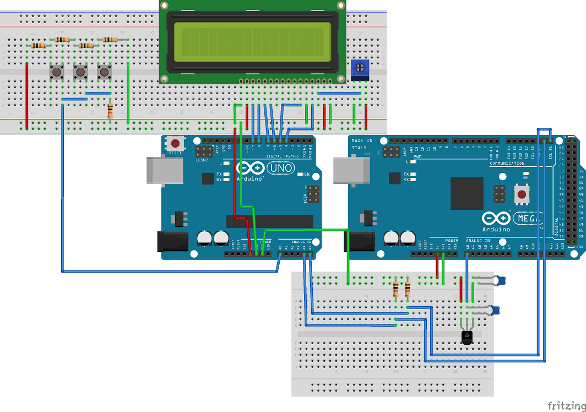

LCD multinode proof of concept
==============

Connect an LCD to a master node, plus a 3 node selector resistor ladder, to a slave node hooked up to a thermistor (LM35).  

This proof-of-concept builds on the Arduino Due to an Arduino Uno I2C protocol communication as described in this other GitHub [repository](https://github.com/dsikar/due-uno-i2c).  

Now there is an LCD plus a resistor ladder added to the master node and a thermistor added to the slave node. Temperature is set on the master node and, while no PID over is hooked up, read from the slave node. 

  

