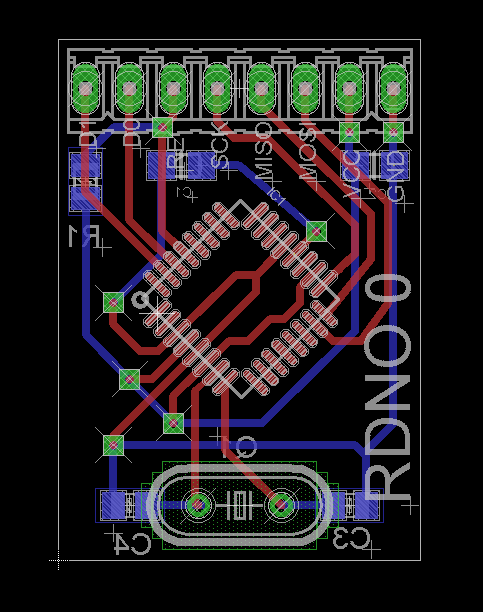
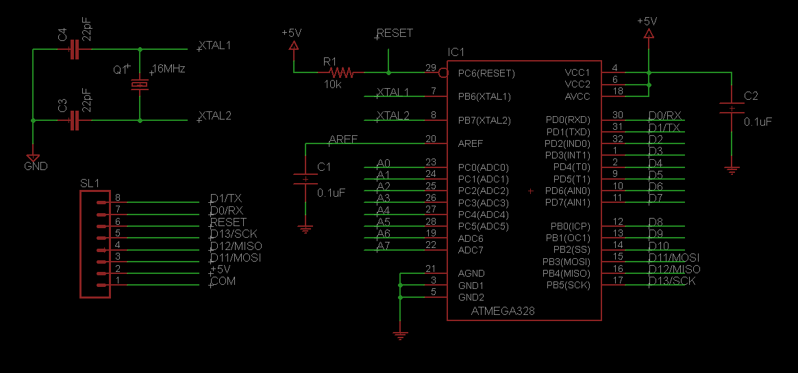
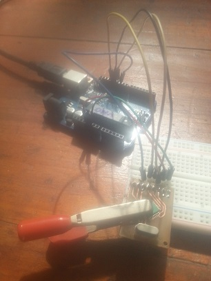
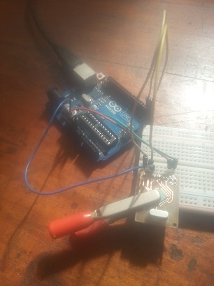
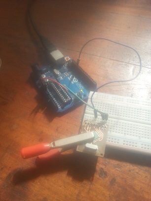
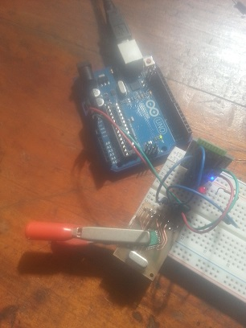

$1 Arduino programmer a.k.a RDNO Zero.
==============

This device provides the following features:  

* Ability to burn a bootloader to an Atmega328 TQFP-32 device.  
* Ability to upload code to an Atmega328p SMD.
* 5 output pins: D0, D1, D11, D12 and D13.  

To burn the bootloader and upload code, [follow these steps] (https://github.com/dsikar/arduino/tree/master/lcd-multinode-master-pidx3#notes-on-configuring-the-arduino-on-a-breadboard), changing the Due board option for Uno.  

Notice that when burning the bootloader, SCK, MOSI, MISO and RESET pins need to be wired. When uploading code, the required pins are RX, TX and RESET. In both cases, Ground and +5V need to be wired.  

Once the code is uploaded, you'll have a very basic Arduino in your hands, and somewhat precarious, given that the chip is secured to board with a crocodile clip, but hey, that is $1's worth of arduino goodness.

The connectors on the board, from left to right, match the SL1 connector in the schematic from top to bottom.

# Gallery

**Burning the bootloader**  
Here we have SCK, MOSI, MISO, RESET, +5V and GND wired    

**Uploading code**
RX, TX, RESET, +5V and GND wired  

**Blink example**
SCK, +5V and GND wired, SCK (D13) wired to UNO's D13 to use the on-board LED  

**Bluetooth LED**
D11, D12, D13, +5V and GND wired, D11 wired to LED, D11 and D12 functioning as RX and TX to [Bluetooth module] (https://github.com/dsikar/jskonit-proof-of-concept)

