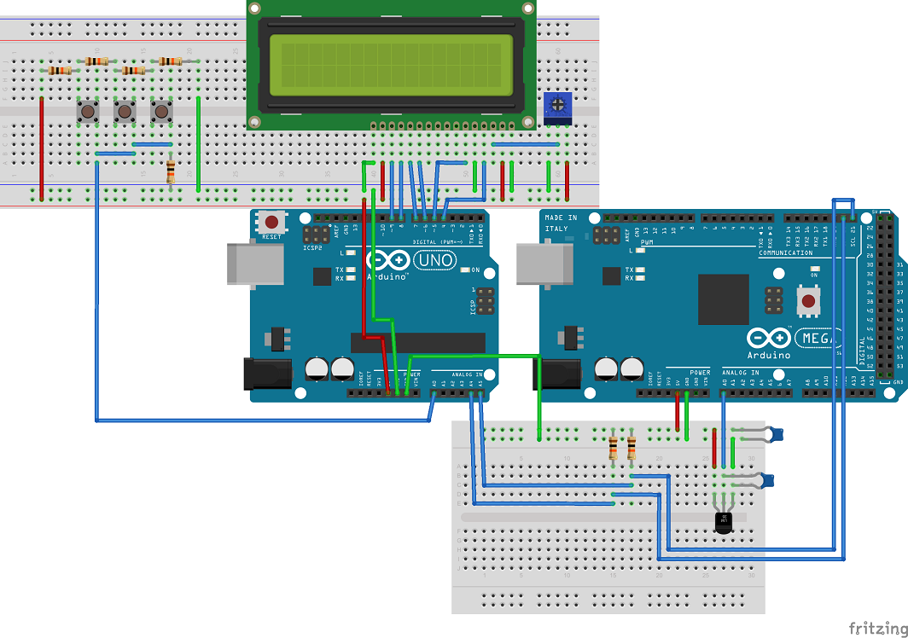

LCD master node with breadboard slave node
==============

Now that the Arduino Uno and Due can communicate using the Wire (I2C) library, I'm substituting the Due for an Arduino on a breadboard.  

What we had to start with was:  

 

Once the Due was swapped, it ended up like this:  

  

# Notes on configuring the Arduino on a breadboard  

To burn the bootloader and upload sketches to the breadboard Arduino, I followed [these instructions](http://www.arduino.cc/en/Tutorial/ArduinoToBreadboard "http://www.arduino.cc/en/Tutorial/ArduinoToBreadboard") on the arduino.cc website.  

Basically, I wire an Arduino Uno to a breadboard Arduino following this Wiring diagram:  

  

I worked with two IDEs, versions 1.0.6 and 1.6.4.    

Burning the bootloader threw the error:  

```
(...)
avrdude: Device signature = 0x1e9514
avrdude: Expected signature for ATMEGA328P is 1E 95 0F
         Double check chip, or use -F to override this check.
(...)
```

The error message states that the device signature does not match the expected device signature, as found in configuration file /hardware/tools/avr/etc/avrdude.conf.  
IDE 1.0.6 calls for a change in the last line shown:  

```
#------------------------------------------------------------
# ATmega328P
#------------------------------------------------------------

part
    id			= "m328p";
    desc		= "ATMEGA328P";
    has_debugwire	= yes;
    flash_instr		= 0xB6, 0x01, 0x11;
    eeprom_instr	= 0xBD, 0xF2, 0xBD, 0xE1, 0xBB, 0xCF, 0xB4, 0x00,
			  0xBE, 0x01, 0xB6, 0x01, 0xBC, 0x00, 0xBB, 0xBF,
			  0x99, 0xF9, 0xBB, 0xAF;
    stk500_devcode	= 0x86;
    # avr910_devcode	= 0x;
    signature		= 0x1E 0x95 0xOF;
```

While IDE 1.6.4 calls for a change in the last line shown:  

```
part parent "m328"
    id			= "m328p";
    desc		= "ATmega328P";
    signature		= 0x1e 0x95 0x0F;
```

Once **0x0F** is changed to **0x14**, it is possible to burn the bootloader.  

To upload a sketch to the breadboard Arduino, the wiring diagram changes to:    

  

Note all IDE settings i.e. board set to Arduino Duemilanove w/ ATmega 328 and programmer set to Arduino as ISP as specified in the [tutorial](http://www.arduino.cc/en/Tutorial/ArduinoToBreadboard "tutorial") plus the ATmega328 must be removed from UNO board.  

When uploading the sketch, the error this time is:  

```
(...)
avrdude: Device signature = 0x1e950f
avrdude: Expected signature for ATMEGA328P is 1E 95 14
         Double check chip, or use -F to override this check.
(...)
```

To fix this new error, in the appropriate IDE dependant section of avrdude.conf file, **0x14** is changed to  **0x0F** then the sketch will upload ok.  


